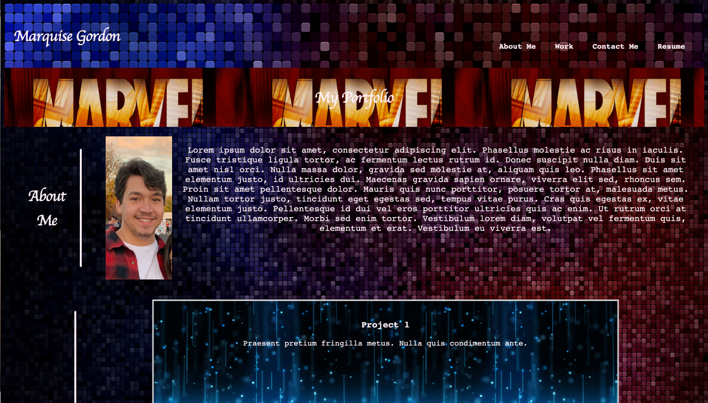

# Portfolio
## Description

Provide a short description explaining the what, why, and how of your project. Use the following questions as a guide:

- The motivaiton for this project was to get an understanding of starting from scratch with a webpage and having fun building a start for our professional portfolios.
- This project helps solve the problem of where to store projects for possible employers to easily see our programing skills.
- I learned how to style a website from the ground up.

## Usage

The webpage is very simplistic. The navigation bar has some functionality. The nav bar can take you to specific parts of the webpage such as:
- About Me
- Work
- Contact Me
- Resume

Once you click on one of the items it takes you to the respected corresponding section of the page.